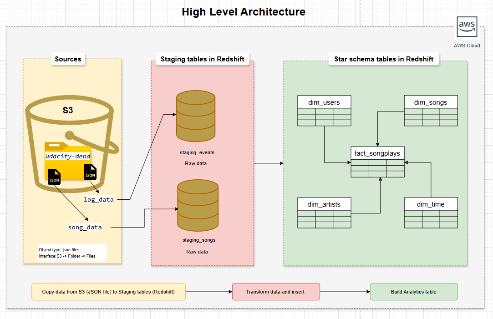

# Data Warehouse with Amazon Redshift

## Project Overview

This project builds a **cloud-based data warehouse using Amazon Redshift** for the Sparkify music streaming startup. The goal is to enable Sparkify’s analytics team to easily query and analyze song play data to understand user behavior and music preferences.

The project extracts JSON log and song data from **Amazon S3**, stages it in **Amazon Redshift**, and transforms it into a **star schema** optimized for analytical queries.

---

## Architecture

The data pipeline follows this architecture:

S3 (Raw Data) → Redshift Staging Tables → Redshift Star Schema → Analytics Queries



------------------------------------------------------------------------

# ☁️ AWS Infrastructure Setup

Before running the ETL pipeline, the following AWS resources must be
configured.

## 1️⃣ Create an IAM Role

Create an IAM role that allows Redshift to read data from Amazon S3.

Steps:

1.  Open **AWS IAM Console**
2.  Click **Roles**
3.  Click **Create Role**
4.  Select **AWS Service**
5.  Choose **Redshift**
6.  Attach the policy:

AmazonS3ReadOnlyAccess

7.  Give the role a name (example: `rubric-role`)
8.  Create the role and copy the **Role ARN**

This role allows Redshift to access data stored in **S3**.

------------------------------------------------------------------------

## 2️⃣ Create a Redshift Cluster

Steps:

1.  Open **Amazon Redshift Console**
2.  Click **Create Cluster**
3.  Select the **Free Tier / Small cluster** (if applicable)
4.  Configure:

Cluster Identifier\
Database Name\
Master Username\
Master Password

5.  In **Permissions**, attach the IAM Role created earlier.
6.  Launch the cluster.

After creation, copy the following details:

-   Cluster Endpoint
-   Port
-   Database Name
-   Username
-   Password

These values will be used in the **dwh.cfg** configuration file.

------------------------------------------------------------------------

## 3️⃣ Configure Security Group (Inbound Rules)

To allow your local machine to connect to the Redshift cluster:

1.  Go to **EC2 Console**
2.  Open **Security Groups**
3.  Select the security group attached to the Redshift cluster
4.  Edit **Inbound Rules**
5.  Add a rule:

Type: Custom TCP\
Port: 5439 (Redshift default port)\
Source: Your IP address or 0.0.0.0/0

This allows external access to the Redshift database.

------------------------------------------------------------------------

# 📂 Dataset

Two datasets stored in **Amazon S3** are used in this project.

## Song Dataset

JSON files containing metadata about songs and artists.

Example fields:

-   song_id
-   title
-   artist_id
-   artist_name
-   duration
-   year

## Log Dataset

JSON log files containing user activity.

Example fields:

-   user_id
-   session_id
-   song
-   artist
-   ts
-   user_agent

------------------------------------------------------------------------

# 🗄 Data Warehouse Schema

The data warehouse uses a **Star Schema** consisting of one fact table
and several dimension tables.

------------------------------------------------------------------------

## Fact Table

### fact_songplays

| Column | Description |
|------|-------------|
| songplay_id | Primary key (auto-generated) |
| start_time | Song play timestamp |
| user_id | User identifier |
| level | User subscription level |
| song_id | Song identifier |
| artist_id | Artist identifier |
| session_id | User session |
| location | User location |
| user_agent | Device / browser information |

---

## Dimension Tables

### dim_users

| Column | Description |
|------|-------------|
| user_id | Primary key |
| first_name | First name |
| last_name | Last name |
| gender | Gender |
| level | Subscription level |

---

### dim_songs

| Column | Description |
|------|-------------|
| song_id | Primary key |
| title | Song title |
| artist_id | Artist identifier |
| year | Release year |
| duration | Song duration |

---

### dim_artists

| Column | Description |
|------|-------------|
| artist_id | Primary key |
| name | Artist name |
| location | Artist location |
| latitude | Latitude |
| longitude | Longitude |

---

### dim_time

| Column | Description |
|------|-------------|
| start_time | Primary key |
| hour | Hour of song play |
| day | Day of month |
| week | Week of year |
| month | Month |
| year | Year |
| weekday | Day of week |

---

# 📥 Staging Tables

Raw data from S3 is first loaded into staging tables.

## staging_events

artist\
auth\
first_name\
gender\
item_in_session\
last_name\
length\
level\
location\
method\
page\
registration\
session_id\
song\
status\
ts\
user_agent\
user_id

---

## staging_songs

num_songs\
artist_id\
artist_latitude\
artist_longitude\
artist_location\
artist_name\
song_id\
title\
duration\
year

------------------------------------------------------------------------

---

## Project Structure
```
datawarehouse-aws-redshift-rubric/
│
├── docs/                               # Documentation images describing the architecture and schema design
│   ├── data_architecture.png           # Diagram showing overall data pipeline (S3 → Redshift → Analytics)
│   ├── staging_tables.png              # Image showing structure of staging tables used for raw data loading
│   └── star_schema.png                 # Star schema diagram showing fact and dimension tables
│
├── scripts/                            # Python scripts used to create tables, run ETL pipeline, and execute analytics queries
│   ├── create_tables.py                # Script to drop existing tables and create staging, fact, and dimension tables
│   ├── etl.py                          # Main ETL pipeline that loads data from S3 to Redshift and populates analytics tables
│   ├── sql_queries.py                  # Contains all SQL queries for table creation, data loading, and data insertion
│   ├── anaytics_queries.py             # Contains analytical SQL queries used to answer business questions
│   └── dwh.cfg                         # Configuration file containing Redshift cluster details, IAM role, and S3 paths
│
├── aws_rubric_screenshots/             # Screenshots demonstrating AWS setup and query results for rubric validation
│   ├── rubric_role_iam.png             # Screenshot showing IAM role created with AmazonS3ReadOnlyAccess policy
│   ├── rubric_user_iam.png             # Screenshot showing IAM user configuration used for AWS access
│   ├── rubric_cluster_redshift.png     # Screenshot showing the Redshift cluster creation page
│   ├── rubric_cluster_info.png         # Screenshot displaying Redshift cluster endpoint and status
│   ├── rubric_cluster_associated_iam.png # Screenshot showing IAM role attached to the Redshift cluster
│   ├── rubric_cluster_db_config.png    # Screenshot showing database configuration details
│   └── Star_schema_query_results.png   # Screenshot showing query results validating star schema tables
│
├── README.md                           # Project overview, architecture, ETL explanation, and setup instructions
└── LICENSE                             # License information for the repository
```
------------------------------------------------------------------------

# ⚙️ ETL Pipeline

The ETL pipeline performs three main steps.

## 1️⃣ Create Tables

Run:

    python create_tables.py

This script:

-   Drops existing tables
-   Creates staging tables
-   Creates fact and dimension tables

------------------------------------------------------------------------

## 2️⃣ Load Staging Tables

Run:

    python etl.py

This loads JSON data from **S3** into:

-   staging_events
-   staging_songs

using the **Redshift COPY command**.

------------------------------------------------------------------------

## 3️⃣ Transform and Load Data

Data is then transformed and inserted into:

-   fact_songplays
-   dim_users
-   dim_songs
-   dim_artists
-   dim_time

------------------------------------------------------------------------

# 🔎 Example Queries

Check record counts:

``` sql
select count(*) from staging_events;
select count(*) from staging_songs;
select count(*) from fact_songplays;
select count(*) from dim_songs;
select count(*) from dim_users;
select count(*) from dim_artists;
select count(*) from dim_time;
```

------------------------------------------------------------------------

# 🚀 Skills Demonstrated

-   Data Warehousing
-   ETL Pipeline Development
-   AWS Redshift
-   Star Schema Data Modeling
-   Python Database Integration
-   Cloud Data Engineering

------------------------------------------------------------------------

## Acknowledgements

This project Rubric was developed as part of the **AWS Data Engineering Nanodegree Program** offered by **Udacity**.

The project Rubric requirements, dataset, and evaluation were provided through the **Sparkify Data Warehouse Project** in the Nanodegree curriculum. The goal of the project is to design and implement a **data warehouse using Amazon Redshift**, build an **ETL pipeline**, and demonstrate analytical capabilities using a **star schema data model**.

All implementation, ETL pipeline development, and analytical queries in this repository were completed as part of the learning process while following the guidelines and rubric provided in the Udacity course materials.

------------------------------------------------------------------------

## License
This project is licensed under the MIT License.
